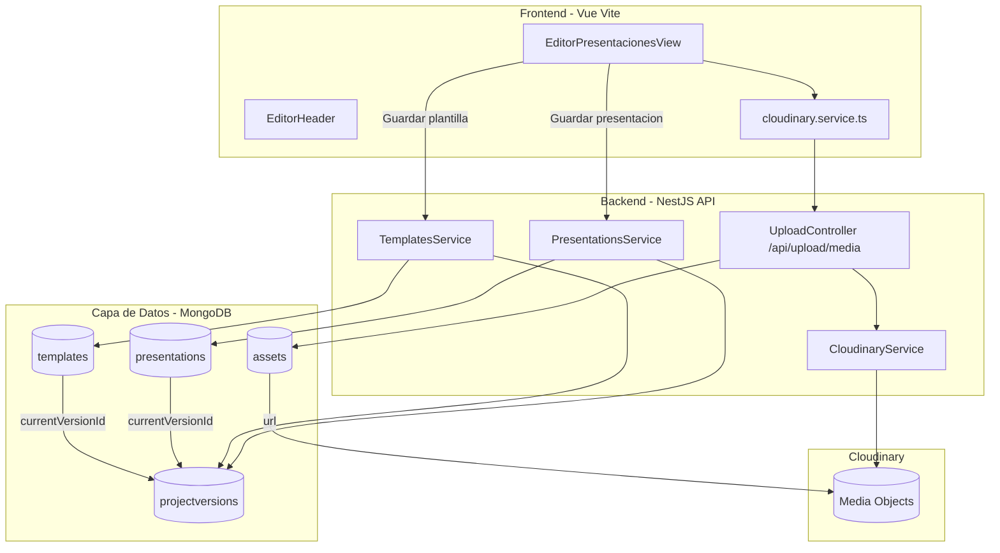

# Arquitectura 4 Capas - Estado Actual

Este documento describe la arquitectura actual despues de los cambios de unificacion de almacenamiento, deduplicacion y versionado de estado.

## Resumen

Objetivo principal:
- Reducir uso de espacio.
- Evitar duplicados de archivos.
- Separar metadata ligera de estado pesado.
- Proteger credenciales de nube en backend.

## Diagrama General

## Capa 1: Cliente Ligero

Componentes principales:
- src/views/EditorPresentacionesView.vue
- src/components/EditorHeader.vue
- src/services/cloudinary.service.ts

Reglas actuales:
- Cliente no usa API Key/Secret de Cloudinary.
- Cliente sube media al backend en /api/upload/media.
- Miniaturas se muestran en tiempo real local y luego sincronizan URL remota.
- Menu de usuario usa Teleport a body + fixed para superponerse a toda UI.

## Capa 2: API y Servicios

Piezas principales:
- src/upload/upload.controller.ts
- src/cloudinary/cloudinary.service.ts
- src/presentations/presentations.service.ts
- src/templates/templates.service.ts

Responsabilidades:
- UploadController deduplica por hash sha256.
- CloudinaryService centraliza subida de buffers.
- PresentationsService guarda metadata en presentations y estado comprimido en projectversions.
- TemplatesService guarda metadata en templates y estado comprimido en projectversions.

## Capa 3: Metadata + Versiones

Colecciones:
- presentations: metadata ligera (titulo, tipo, dimensiones, coverImage, currentVersionId, etc).
- templates: metadata ligera (autor, titulo, privacidad, currentVersionId, etc).
- projectversions: estado comprimido del lienzo (compressedState) por entidad.

Ventaja:
- Lectura de bibliotecas mas rapida.
- Menos riesgo de documentos Mongo gigantes.
- Historial/iteraciones posibles sin duplicar metadata.

## Capa 4: Assets Deduplicados

Coleccion assets:
- hash (unique)
- url
- refCount
- mimeType
- bytes

Flujo:
1. Llega archivo.
2. Backend calcula hash.
3. Si hash existe, aumenta refCount y reutiliza URL.
4. Si hash nuevo, sube a Cloudinary y crea registro.

Beneficio:
- Menos almacenamiento total.
- Menos transferencias repetidas.
- Reuso real entre proyectos/usuarios.

## Variables de Entorno Clave

Backend:
- CLOUDINARY_NAME
- CLOUDINARY_KEY
- CLOUDINARY_SECRET
- URI
- JWT_SECRET

Frontend:
- VITE_BACKEND_URL

## Flujo de Guardado (Presentacion/Plantilla)

1. Front prepara payload y referencias de media.
2. Media sube por /api/upload/media.
3. Backend deduplica y devuelve URL.
4. Front guarda proyecto en endpoint de dominio.
5. Backend guarda metadata en presentations/templates.
6. Backend guarda compressedState en projectversions.
7. Backend actualiza currentVersionId en metadata.

## Estado de Migracion

Completado:
- Unificacion de subida de media por backend.
- Deduplicacion de assets.
- Separacion metadata/estado.
- Versionado comprimido para presentaciones y plantillas.

Pendiente recomendado:
- Script de migracion para datos legacy (GridFS/base64 antiguo).
- Recoleccion de basura de assets (bajar refCount y borrar huérfanos).
- Politica de retencion de versiones (ej: ultimas N + hitos).
